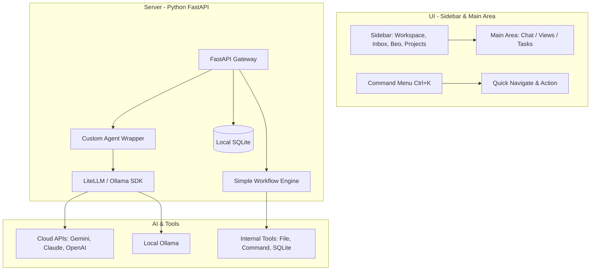
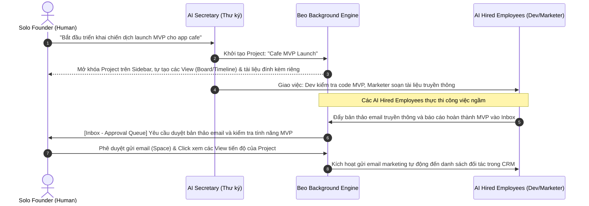

# Yêu cầu Tài liệu Sản phẩm (PRD) - Dự án Beo
**Framework Hỗ trợ Vận hành Doanh nghiệp Một Thành viên (One-Man Company)**

---

## 1. Vấn đề cần giải quyết & Giá trị cốt lõi

### 1.1 Ứng dụng dùng để làm gì?
**Beo** là một framework mã nguồn mở, tối giản và cục bộ (local-first) giúp một cá nhân (Solo Entrepreneur, Indie Hacker, Freelancer) xây dựng, quản lý và vận hành toàn bộ doanh nghiệp của mình thông qua hệ thống nhân sự ảo (AI Agents) và các quy trình tự động hóa thông minh do AI tự lập kế hoạch.

### 1.2 Những gì các giải pháp hiện tại chưa làm được (Gaps in Existing Solutions)
* **Quá tải thông tin và kỹ năng (Cognitive & Skill Overload):** Các công cụ hiện tại (Trello, Jira, HubSpot) đòi hỏi người dùng phải tự học và làm tất cả mọi việc (từ Marketing, Sales, đến Dev, Support, Soạn thảo văn bản pháp lý). Một người không thể giỏi và làm hết tất cả các mảng này.
* **Quy trình tự động hóa phức tạp:** Các nền tảng như Zapier, n8n đòi hỏi cấu hình logic thủ công (if/else, mapping dữ liệu) rất phức tạp. Khi quy trình thay đổi, việc bảo trì luồng chạy tốn rất nhiều thời gian.
* **Chi phí SaaS phân mảnh quá đắt đỏ:** Việc duy trì cùng lúc 5-10 dịch vụ SaaS riêng lẻ (CRM, Email Marketing, Task Management, AI Chat, Analytics) tạo gánh nặng tài chính lớn cho mô hình kinh doanh một người.
* **Thiếu vai trò quyết định tối cao của con người:** Nhiều hệ thống AI agent tự động hóa chạy độc lập dễ bị lặp vô tận (infinite loop) hoặc tạo ra kết quả sai lệch (hallucination) mà người dùng không kiểm soát được kịp thời.

### 1.3 Beo giải quyết điều gì?
* **Ủy thác công việc cho AI Agent:** Beo cung cấp các "nhân sự ảo" đảm nhận các vai trò phòng ban khác nhau (Marketing, Planning, MVP tracking, Pitching). Người dùng chỉ đóng vai trò là **người duyệt và kiểm tra cuối cùng (Human-in-the-loop)** thông qua Hàng đợi phê duyệt.
* **AI tự động sinh luồng công việc (AI-Generated Workflows):** Người dùng chỉ cần nhập mục tiêu, AI sẽ tự lập kế hoạch công việc và các bước thực thi, sau đó gửi cho người dùng phê duyệt từng bước trước khi chạy.
* **Tập trung vào Ý tưởng & Bức tranh toàn cảnh (Big Picture & Ideation Focus):** Giải phóng người dùng hoàn toàn khỏi các chi tiết vận hành vụn vặt, các thủ tục kỹ thuật/pháp lý/tài chính rắc rối. Beo giúp solo founder dành 90% năng lượng và thời gian để tư duy chiến lược, phát triển ý tưởng mới và quan sát tổng thể hoạt động của doanh nghiệp từ trên cao.
* **Tập trung hóa và Tiết kiệm chi phí:** Thay thế các SaaS riêng lẻ bằng một framework chạy cục bộ, hỗ trợ cả API đám mây (Gemini, Claude, GPT) và Local LLM (Ollama) miễn phí.

### 1.4 Nguồn tham khảo & Cảm hứng
* **Triết lý "Company of One" (Paul Jarvis):** Tập trung vào việc tối ưu hiệu quả của một cá nhân thay vì cố gắng scale quy mô nhân sự truyền thống.
* **Phong trào Solo Entrepreneur / Indie Hackers:** Tinh thần tự lực cánh sinh, tinh gọn, hướng đến xây dựng sản phẩm nhanh và hiệu quả.
* **Thiết kế tối giản của ứng dụng Linear:** Giao diện tốc độ cao, điều khiển bằng bàn phím (typing-centric), tinh tế, không màu mè dư thừa.

### 1.5 Nguyên tắc thiết kế (Design Principles)
1. **AI-First & Agentic:** AI thực thi, con người phê duyệt. Mọi hành động của Agent đều phải được xếp hàng chờ người dùng nhấn duyệt (Approval Queue).
2. **Keyboard-Driven & Typing-Centric (Giống Linear):** Tối ưu hóa cho việc nhập lệnh nhanh (Command Menu - `Cmd+K` hoặc `Ctrl+K`), giảm thiểu click chuột.
3. **Tối giản và Tập trung (Minimalist & Low Cognitive Load):** Giao diện xám đen/charcoal cao cấp, không dùng màu neon lòe loẹt. Chỉ hiển thị các chỉ số cốt lõi và danh sách cần duyệt.
4. **Tập trung vào bức tranh toàn cảnh (Big Picture Focus):** Cung cấp các công cụ tóm tắt, sơ đồ tiến độ dự án, và dashboard trực quan để người dùng luôn nắm bắt được trạng thái vĩ mô của doanh nghiệp mà không bị chìm trong núi tác vụ nhỏ.
5. **Local-First & Bảo mật:** Dữ liệu thuộc về người dùng, lưu trữ local bằng SQLite, hỗ trợ offline và bảo mật thông tin doanh nghiệp tối đa.

---

## 2. Kiến trúc tổng thể (Overall Architecture)

Beo sử dụng kiến trúc Client-Server tinh gọn:

---

## 3. Chi tiết cấu tạo (Detailed Components)

### 3.1 Kiến trúc Swarm-Centric Workforce (Mô phỏng Nhân sự Cộng tác)
* **Custom Agent Wrapper:** Nhằm giữ độ phức tạp tối thiểu cho v1, chúng ta chưa tích hợp Docker container hay giao thức MCP phức tạp. Thay vào đó, toàn bộ Agent được mô phỏng logic qua một Wrapper LLM duy nhất:
  * **Mô phỏng vai trò (Role Simulation):** Các nhân sự ảo được phân biệt bằng **System Prompt** và **Quyền hạn sử dụng công cụ (Tool Permissions)** được cấu hình riêng trong file phẳng.
  * **Cô lập logic (Logical Sandbox):** Mỗi Agent chạy dưới dạng một tiến trình/luồng chạy hoặc tác vụ logic biệt lập trong Python backend.
  * **Quyền hạn công cụ nghiêm ngặt (Tool Permissions):** Mọi hành động nhạy cảm như ghi file, sửa file hay chạy mã nguồn/lệnh shell đều bắt buộc phải được gửi vào Hàng đợi phê duyệt (Approval Queue) để người dùng xác nhận. Mọi hành động đều được ghi log đầy đủ.
  * **Phòng ngừa vòng lặp vô hạn (Loop Guard):** Thiết lập cơ chế tự động ngắt nếu Agent dính vào vòng lặp logic (ví dụ: sửa file lỗi -> chạy test lỗi -> thử lại) quá 3-5 lần liên tiếp. Hệ thống sẽ tạm dừng tác vụ và đẩy yêu cầu trợ giúp ra Inbox của người dùng để tránh cạn kiệt tài khoản API (burn API budget).
  * **Định hướng tương thích tương lai:** Thiết kế tool interface tương thích để dễ dàng nâng cấp lên Model Context Protocol (MCP) và Docker container isolation ở các phiên bản sau (Pha 3).
* **Cơ chế Swarm-Centric Workforce (Lực lượng lao động Swarm):**
  Thay vì hoạt động độc lập hoặc phân cấp cứng nhắc, các Agent của Beo hoạt động như một **Swarm (Bầy đàn/Nhóm tự quản)**. Khi có một nhiệm vụ phức tạp, hệ thống tự động thành lập một nhóm Swarm để cùng hợp tác giải quyết.
* **5 Vai trò nhân sự ảo cốt lõi (Core Roles):**
  1. **AI Thư ký (Secretary Agent):** Điều phối chính toàn bộ doanh nghiệp, nhận lệnh trực tiếp từ người dùng, quản lý tiến trình của các Swarm khác, và gửi các nhiệm vụ cần duyệt vào Inbox của người dùng.
  2. **AI Lập kế hoạch (Planner Agent):** Tư duy chiến lược, nghiên cứu định vị sản phẩm, phác thảo lộ trình dự án và cấu trúc vận hành.
  3. **AI Phát triển (Developer Agent):** Chuyên viết mã nguồn, chạy thử nghiệm, debug và xây dựng sản phẩm MVP thực tế.
  4. **AI Truyền thông (Marketer Agent):** Biên soạn bài viết marketing, nội dung pitch deck, lập kế hoạch quảng bá và soạn email gửi khách hàng/đối tác.
  5. **AI Tài chính & Pháp lý (Finance/Legal Agent):** Kiểm soát ngân sách API của toàn hệ thống, ước tính doanh thu/chi phí và soạn thảo các văn bản thỏa thuận/pháp lý cơ bản.

### 3.2 Hàng đợi phê duyệt (Approval Queue) - Trái tim của Beo
* Mọi hành động do AI đề xuất đều phải đi qua Approval Queue trước khi được thực thi. Mỗi mục phê duyệt (Approval Item) bắt buộc chứa:
* **Loại hành động (Action Type):** (ví dụ: ghi file `write_file`, thực thi lệnh `run_command`, gửi email `send_email`, hay deploy swarm `deploy_swarm`).
* **Nội dung đề xuất (Proposed Content):** Dòng code sẽ chèn, nội dung email viết, lệnh shell chuẩn bị chạy, hoặc cấu trúc thành viên Swarm đề xuất.
* **Lý do thực hiện (Rationale):** Giải thích tại sao AI cần làm bước này.
* **Mức độ rủi ro (Risk Level):** Đánh giá mức độ nguy hiểm (e.g. LOW cho ghi file nháp, HIGH cho chạy script/lệnh hệ thống hoặc khởi động Swarm quy mô lớn).
* **Chi phí ước tính (Cost Estimate):** Số lượng token dự kiến tiêu thụ hoặc chi phí tiền mặt.
* **Nút tương tác:** **Approve (Phê duyệt)** / **Edit (Chỉnh sửa nội dung)** / **Reject (Từ chối)**.
* **Cơ chế chỉnh sửa nâng cao (UI Diff & Local IDE):** 
  * Đối với các hành động chèn/ghi đè file code lớn, UI cung cấp một khung soạn thảo (Monaco Editor/CodeMirror) hỗ trợ hiển thị Diff rõ ràng trước khi người dùng xác nhận.
  * Vì ứng dụng chạy local-first, người dùng có thể dễ dàng mở trực tiếp file đó trong IDE cá nhân (như VS Code/Cursor) để chỉnh sửa kỹ lưỡng sau khi phê duyệt, hoặc từ chối để Agent lập lại kế hoạch mới.

### 3.3 Swarm Orchestrator Engine (Bộ máy Điều phối Swarm Đa dạng)
Bộ máy quy trình của Beo nâng cấp từ workflow tuần tự cơ bản thành một **Swarm Orchestrator Engine** hỗ trợ ba chế độ vận hành (Execution Topologies) linh hoạt:

1. **Sequential Mode (Chế độ Tuần tự):**
   * Các Agent thực thi nhiệm vụ lần lượt theo chuỗi (ví dụ: Researcher thực hiện trước -> Planner lập kế hoạch dựa trên kết quả -> Developer viết code dựa trên kế hoạch).
   * Ngữ cảnh và deliverables của bước trước được tích lũy và truyền trực tiếp vào prompt của Agent bước sau dưới dạng **Cumulative Context**.

2. **Parallel Mode (Chế độ Song song):**
   * Các Agent làm việc trên các nhiệm vụ độc lập của họ cùng một lúc (chạy đa luồng - Python Multithreading).
   * Ví dụ: Developer viết code MVP trong khi Marketer đồng thời soạn thảo email marketing và nội dung mạng xã hội.
   * Kết quả đầu ra và các file do các Agent tạo ra sẽ được tổng hợp đầy đủ và đồng bộ tại cuối tiến trình.

3. **Collaborative/Consensus Mode (Chế độ Cộng tác/Thảo luận):**
   * Các Agent trong Swarm tham gia vào một phiên chat nhóm đa chiều (Round-Robin Multi-Agent Discussion).
   * Qua các lượt thảo luận (ví dụ: 2 lượt xoay vòng), các Agent phản biện, đóng góp ý kiến và tối ưu hóa giải pháp của nhau (ví dụ: Marketer đưa ra yêu cầu sản phẩm -> Developer phản hồi về tính khả thi kỹ thuật -> Planner điều chỉnh lộ trình).
   * Toàn bộ tiến trình đối thoại giữa các Agent (Agent-to-Agent transcript) được ghi lại thời gian thực và hiển thị trực quan dưới dạng Chat bubbles sinh động trên giao diện UI.
   * Kết quả deliverables cuối cùng (file code, slide, csv) được kết tinh sau sự đồng thuận của cả nhóm.

* **Cơ chế xử lý lỗi (Failure Handler):** Khi một Swarm member gặp lỗi runtime (ví dụ: Dev Agent chạy test bị crash), bước đó chuyển sang trạng thái `failed`. Logs lỗi chi tiết sẽ được đẩy vào Inbox để người dùng quyết định: **Chạy lại (Retry)**, **Bỏ qua (Skip)**, hoặc **Chỉnh sửa dữ liệu đầu vào (Edit & Resume)**.

### 3.4 File Knowledge Hub & Tài liệu Công ty
Beo ưu tiên lưu trữ local dưới dạng cấu trúc thư mục phẳng trong workspace, hỗ trợ đa dạng định dạng tệp tin (Markdown, Code, Text, Log, CSV...):
* **Phân tách không gian làm việc (Workspace Isolation):** Để tránh xung đột dữ liệu khi chuyển đổi workspace, cấu trúc thư mục được phân tách rõ ràng trên đĩa cứng cục bộ theo `workspace_id`:
  * `/workspaces/<workspace_id>/workspace/` (Thư mục dùng chung của doanh nghiệp - Tài liệu Công ty)
  * `/workspaces/<workspace_id>/projects/<project_name>/` (Thư mục riêng của từng dự án)
* **Cơ chế hoạt động Local-First (Disk-as-Source-of-Truth):**
  * Beo không lưu trữ bản sao nội dung tệp tin trong database SQLite. SQLite chỉ lưu metadata và nhật ký hoạt động.
  * Mọi hành động đọc/ghi của giao diện người dùng đều được thực hiện trực tiếp thời gian thực xuống đĩa cứng cục bộ, đảm bảo tính đồng bộ tuyệt đối khi người dùng chỉnh sửa bằng các IDE bên ngoài (VS Code/Cursor).
* **Phản ứng tự động khi thay đổi cấu hình (Reactive Config Watcher):**
  * Khi phát hiện file `/workspace/OPERATIONS.md` bị chỉnh sửa (bởi người dùng trực tiếp trên ổ đĩa hoặc qua giao diện), Backend Beo sẽ tự động đọc lại, cập nhật danh sách phòng ban trên Sidebar và reload cấu hình nhân viên AI tương ứng ngay lập tức mà không cần restart.
* **Đa định dạng hiển thị (File Renderers) ở Main Area:**
  * `.md`: Render định dạng HTML/Wiki đẹp mắt kèm chế độ Toggle Edit chỉnh sửa trực tiếp.
  * `.py`, `.js`, `.json`, `.yaml`, `.env`: Render kèm highlight cú pháp code và bộ gõ soạn thảo.
  * `.csv`: Hiển thị dưới dạng bảng dữ liệu có thể tìm kiếm, lọc và sắp xếp.
  * `.log`: Hiển thị dạng cửa sổ dòng log cuộn thời gian thực.
* **Cấu trúc thư mục Workspace (Tài liệu Công ty):**
  * `/workspace/AIM.md` (Tầm nhìn & Sứ mệnh tổng thể)
  * `/workspace/OPERATIONS.md` (Cơ cấu phòng ban & nhân sự AI)
  * `/workspace/FINANCE.md` (Ngân sách API & Pháp lý doanh nghiệp)
  * `/workspace/any_files.ext` (Các tài liệu hướng dẫn, file văn bản, CSV contacts khác của doanh nghiệp)
  * *Lưu ý:* Khi hoàn thành onboarding, các file này sẽ xuất hiện trong phân hệ **Tài liệu Công ty (Company Files)** trên Sidebar để người dùng xem và quản trị tập trung.
* **Cấu trúc thư mục Dự án (Projects):**
  * `/projects/<project_name>/PRODUCT.md` (Đặc tả tính năng sản phẩm, MVP Scope, Tech Stack, và Definition of Done của riêng dự án đó)
  * `/projects/<project_name>/LOG.md` (Log hoạt động chi tiết của dự án)
  * `/projects/<project_name>/attachments/` (Thư mục chứa các tài liệu đính kèm liên quan)
* **Quản lý dữ liệu (CRM / Contacts):** Lưu trữ dưới dạng tệp phẳng (e.g. `CONTACTS.md`) hoặc bảng SQLite đơn giản để lưu trữ danh sách đối tác và khách hàng mà không làm phức tạp hóa hệ thống.

---

## 4. UI/UX Design System (Mô phỏng Linear & Typing-Centric)

* **Triết lý thiết kế:** Tối giản như ứng dụng Linear, tập trung vào gõ phím (typing-centric), tốc độ phản hồi tức thì, không sử dụng màu neon lòe loẹt mà sử dụng các tone màu dịu, viền mỏng tinh tế.
* **Hệ thống Typography (Kiểu chữ cao cấp):**
  * **Font chữ chính (Body & Interface):** Sử dụng `Inter Variable` hoặc `Inter` làm phông chữ chính để đảm bảo khả năng hiển thị rõ nét ở kích cỡ nhỏ.
  * **Font chữ tiêu đề (Headings):** Sử dụng `Outfit` hoặc `Inter` với độ dày lớn (`font-weight: 600` hoặc `700`) và khoảng cách chữ khít hơn (`letter-spacing: -0.02em`) để tạo cảm giác chuyên nghiệp, hiện đại.
  * **Font chữ mã lệnh & Phím tắt:** Sử dụng phông chữ đơn cách (Monospace) như `JetBrains Mono`, `SF Mono` hoặc `Fira Code` cho các phím tắt, dòng lệnh, và tên tệp tin để tăng độ tương phản thông tin.
  * **Tỷ lệ hiển thị:** Cấu hình chuẩn kích thước chữ chặt chẽ (12px cho text nhỏ/nhãn, 14px cho text thân bài, 16px/20px/24px cho các cấp tiêu đề).
* **Họa tiết địa hình nền (Topography SVG Pattern):**
  * Sử dụng một họa tiết vẽ các đường địa hình (contour/topographic lines) hoặc chấm lưới (grid dots) màu xám mờ siêu mảnh (`opacity: 0.03` - `0.05` trên nền đen `#000000` hoặc `#090909`) ở lớp nền phía sau bảng làm việc chính. Điều này tạo ra chiều sâu không gian công nghệ tinh tế, giảm bớt sự đơn điệu của giao diện tối giản mà không làm xao nhãng trải nghiệm nhập lệnh.
* **Tone màu chủ đạo & Biến CSS (Từ mã nguồn Linear thực tế):**
  * **Chế độ tối (Dark Mode):**
    * `--bg-sidebar-dark`: `#090909` (Nền sidebar xám đen cực sâu)
    * `--bg-base-color-dark`: `#0f0f11` (Nền bảng làm việc chính)
    * `--bg-border-color-dark`: `#1c1e21` (Màu viền phân cách mỏng tinh tế)
    * `--content-color-dark`: `#6b6f76` (Màu chữ thường/phụ)
    * `--content-highlight-color-dark`: `#ffffff` (Màu chữ nổi bật/tiêu đề)
  * **Bán kính bo góc & Kích thước:**
    * Bo góc bảng làm việc chính: `border-radius: 12px`
    * Chiều rộng sidebar: `var(--sidebar-width)` = `244px`
    * Khoảng cách bảng làm việc: `margin: 8px`
* **Hiệu ứng bố cục nổi bật (Floating borders):**
  * Phần bảng làm việc chính (**Main Area** / `#appBorders`) sẽ được hiển thị như một khung panel nổi bo tròn nằm trong cửa sổ ứng dụng, nổi bật trên lớp nền họa tiết địa hình phía sau:
    `border: 1px solid var(--bg-border-color); background-color: var(--bg-base-color); margin: 8px; margin-left: var(--sidebar-width); border-radius: 12px;`
* **Phím tắt chính (Keyboard Shortcuts):**
  * `Ctrl + K` (hoặc `Cmd + K`): Mở Command Menu tìm nhanh phòng ban, chuyển tác vụ, hoặc ra lệnh cho Beo.
  * `Space`: Phê duyệt nhanh phần tử đang chọn trong Inbox.
  * `Esc`: Đóng cửa sổ đang mở.
* **Bố cục giao diện (2 phần rõ rệt):**
  1. **Sidebar (Cột bên trái - 244px):**
     * **Workspace Switcher:** Hiển thị tên Workspace hiện tại đang mở. Khi người dùng **click vào tên Workspace**, một menu thả xuống (dropdown selector) sẽ xuất hiện cho phép chuyển đổi nhanh chóng giữa các không gian làm việc khác nhau (ví dụ: chuyển giữa nhiều dự án hoặc các công ty one-man khác nhau).
     * **Thư ký (General Secretary AI):** Một mục chat riêng biệt nằm trực tiếp dưới Workspace. Đây là kênh liên lạc riêng tư giữa người dùng và **AI Thư ký tổng** (AI điều phối chính), giúp tiếp nhận yêu cầu chung, theo dõi tình hình toàn hệ thống, hoặc ra lệnh trực tiếp cho các phòng ban khác.
     * **Tài liệu Công ty (Company Files / Wiki):** Phân hệ hiển thị toàn bộ thư mục `/workspaces/<workspace_id>/workspace/` (gồm `AIM.md`, `OPERATIONS.md`, `FINANCE.md` và các tài liệu chung). Khi click vào, người dùng có thể xem và chỉnh sửa trực tiếp thông qua các file renderers chuyên biệt.
     * **Danh sách Phòng ban (Departments) thuộc Workspace:** Chia thành các phân hệ chức năng (Marketing, Engineering, CRM, v.v.). Nhấn vào mỗi phòng ban sẽ hiển thị:
       * **Chat:** Cho phép chat nhóm với toàn bộ Agent trong phòng ban, hoặc chọn một Agent cụ thể để nhắn tin riêng.
       * **Views (Các chế độ hiển thị dữ liệu):** AI có thể **tự động tạo ra nhiều view khác nhau** tùy theo nhu cầu thực tế của phòng ban (không giới hạn số lượng). Hỗ trợ các chế độ hiển thị như: **Board** (bảng Kanban), **List** (danh sách công việc), **Calendar** (lịch), hoặc **Timeline** (đường tiến độ).
     * **Dự án (Projects):** Danh sách các dự án cụ thể đang chạy (ví dụ: *"Project Alpha"*, *"Launch Campaign"*). Mỗi dự án sẽ có:
       * **Views riêng biệt:** Các view (Board, List, Calendar, Timeline) do AI tự xây dựng tối ưu cho đặc thù của riêng dự án đó.
       * **Tài liệu & Kho tài liệu đính kèm cụ thể:** Mỗi project sở hữu một wiki/kho tài liệu và tệp tin đính kèm riêng biệt. Trong đó bắt buộc có file **`PRODUCT.md`** để đặc tả sản phẩm riêng của dự án đó (Product Specifications, MVP Scope, Tech Stack, Definition of Done - DoD).
     * **Inbox:** Hộp thư chứa các hành động chờ chủ doanh nghiệp duyệt (Approval Queue, thông báo quan trọng).
     * **Beo:** Hiển thị danh sách các tiến trình/tác vụ nền mà AI đang chạy ngầm (ví dụ: *"Beo đang lên chiến dịch campaign"*, *"Beo đang xử lý tệp tài liệu CRM"*). Người dùng có thể click vào để xem chi tiết tiến độ hoặc log của tiến trình đó.
  2. **Main Area (Vùng nội dung chính bên phải - Panel nổi bo góc):**
     * Hiển thị nội dung tương ứng khi click vào Sidebar: giao diện Chat (với phòng ban, Agent riêng lẻ hoặc Thư ký), các View dữ liệu do AI cấu hình (Board/List/Calendar/Timeline) của phòng ban hoặc dự án, kho tài liệu đính kèm, nội dung phê duyệt của Inbox, hoặc thông tin chi tiết các tác vụ ngầm đang thực thi của Beo.

---

## 5. Dependencies (Các thư viện & Công nghệ sử dụng)

### Backend (Python):
* **Core Web & Data Framework:** `fastapi`, `uvicorn`, `pydantic` để làm API gateway.
* **LLM Orchestration:** `litellm` (gọi các API đám mây) và `ollama` (gọi LLM chạy local).
* **Database & ORM:** `sqlite3` kết hợp với `sqlalchemy` (hoặc `sqlmodel`) để quản lý dữ liệu quan hệ cục bộ.
* **Task Queue & Background Execution:** `apscheduler` (hoặc `rq`) để chạy ngầm và xếp lịch các tác vụ phức tạp của Beo.
* **Vector Database (Local Memory):** `lancedb` (hoặc `chromadb`) làm cơ sở dữ liệu vector cục bộ phục vụ cho bộ nhớ Agent và tìm kiếm ngữ cảnh.
* **Document Parsing & Analytics:** `pymupdf` (đọc PDF), `python-docx` (đọc Word), `openpyxl` (đọc Excel) và `pandas` để phân tích dữ liệu của CRM và Knowledge Hub.
* **Security & Key Management:** `cryptography` / `keyring` để mã hóa và lưu trữ an toàn các API Key của người dùng tại máy local. Đối với các môi trường server/headless không hỗ trợ GUI Keyring Service, hệ thống sẽ tự động fallback sang cơ chế mã hóa AES đối xứng và lưu vào file cấu hình `.env` cục bộ sử dụng một khóa chủ `BEO_MASTER_KEY` lấy từ biến môi trường.
* **Testing:** `pytest` để kiểm thử tự động các module và Agent wrapper.

### Frontend (Node.js & UI):
* **Framework:** `Vite + React` (hoặc `Next.js` để SSR nhanh chóng).
* **Styling & Components:** `TailwindCSS` tối giản kết hợp với bộ UI library `shadcn/ui` để phát triển nhanh giao diện đẹp, chất lượng hoàn thiện cao kiểu Linear.
* **Icons:** `lucide-react` (icons tối giản, sắc nét).
* **State Management & Fetching:** `zustand` để quản lý trạng thái global (như đóng mở sidebar, thông tin workspace) và `tanstack-query` để đồng bộ dữ liệu real-time từ API.

### Observability (Giám sát hoạt động):
* **Giai đoạn 1:** Ghi log hoạt động của các Agent trực tiếp vào bảng SQLite cục bộ để dễ truy vấn tại chỗ.
* **Giai đoạn tiếp theo:** Tích hợp `Langfuse` (local/cloud) để giám sát vết hội thoại (tracing), thống kê lượng token tiêu thụ và chi phí gọi LLM chi tiết.

---

## 6. Ví dụ hoạt động & Trải nghiệm Người dùng

### 6.1 Trải nghiệm 5 phút đầu tiên (First 5-Minute Onboarding)
*Giải quyết bài toán "trang giấy trắng" (cold start), giúp người dùng thiết lập doanh nghiệp one-man ngay lập tức thông qua các file tài liệu đặc tả riêng biệt:*

1. **Khởi đầu trống (Empty Start):** Khi mở ứng dụng Beo lần đầu tiên, giao diện Sidebar hoàn toàn trống trơn và tối giản tối đa. Chỉ có duy nhất một kênh chat hoạt động: **Thư ký (Secretary)**. Không có phòng ban, dự án hay inbox nào khác.
2. **Khởi tạo trò chuyện:** Người dùng bắt đầu chat với Thư ký về ý tưởng và định hướng doanh nghiệp của mình.
3. **Phỏng vấn nhanh:** Thư ký AI sẽ đặt câu hỏi ngắn gọn, trọng tâm để làm rõ nhu cầu và mong muốn của người dùng.
4. **Soạn thảo các tài liệu đặc tả doanh nghiệp (Modular Specifications):** Từ thông tin phỏng vấn ban đầu, Thư ký AI sẽ tự động phân tích và sinh ra các bản thảo tài liệu tổng quan để thiết lập doanh nghiệp, hiển thị và lưu trực tiếp trong Workspace Knowledge Hub:
   * **`AIM.md` (Tầm nhìn & Mục tiêu doanh nghiệp):**
     * **Vision & Mission:** Sứ mệnh ngắn hạn và dài hạn của công ty.
     * **Core Values:** Các giá trị cốt lõi của tổ chức (tinh gọn, ưu tiên cục bộ, tốc độ).
     * **Target Audience:** Định hướng thị trường và chân dung đối tượng khách hàng mục tiêu chung của doanh nghiệp.
     * **Unique Value Proposition (UVP):** Giá trị cốt lõi mà doanh nghiệp one-man này mang lại.
   * **`OPERATIONS.md` (Bộ máy vận hành & Nhân sự):**
     * **Active Departments:** Các phòng ban đang được kích hoạt trong doanh nghiệp (Marketing, Engineering, CRM, Support...).
     * **Staffing Roster:** Danh sách nhân viên ảo (AI Agents) đề xuất thuê để vận hành doanh nghiệp: vai trò, mô tả công việc, mô hình LLM tương ứng phụ trách (Cloud hoặc Local) và các công cụ được cấp quyền sử dụng.
     * **Communication Protocol:** Phương thức các Agent phối hợp và báo cáo lại cho Thư ký hoặc Inbox của người dùng.
   * **`FINANCE.md` (Tài chính & Pháp lý doanh nghiệp):**
     * **API Budget & Limits:** Giới hạn ngân sách chạy API (USD/ngày hoặc USD/tháng) cho từng Agent và toàn doanh nghiệp để tránh chi phí phát sinh ngoài ý muốn.
     * **SaaS Subscriptions:** Các chi phí dịch vụ bên ngoài tích hợp cùng Beo (nếu có).
     * **Legal Checkpoints:** Các lưu ý pháp lý ban đầu như đăng ký nhãn hiệu, thành lập doanh nghiệp hoặc các điều khoản tuân thủ quyền riêng tư.
5. **Kích hoạt hệ thống:** Khi người dùng duyệt các file tài liệu đặc tả này:
   * Thư ký AI sẽ lưu các file này (`AIM.md`, `OPERATIONS.md`, `FINANCE.md`) vào Knowledge Hub của Workspace.
   * Kích hoạt "thuê" (khởi động) các AI Agent tương ứng theo cấu hình trong `OPERATIONS.md`.
   * Các phòng ban (Departments), mục Dự án (Projects) tương ứng sẽ tự động mở khóa và hiển thị trên Sidebar.
   * Thư ký AI tự động lập kế hoạch công việc ban đầu, giao việc cho các Agent này, và các tiến trình nền của **Beo** bắt đầu khởi chạy ngầm.
   * **Khởi tạo Dự án đầu tiên:** Khi người dùng bắt đầu một Dự án cụ thể trong Workspace, Thư ký AI (hoặc các Agent chuyên môn) sẽ soạn thảo tiếp file **`PRODUCT.md`** cụ thể cho dự án đó (đặc tả tính năng sản phẩm, phạm vi MVP, Tech Stack cụ thể và tiêu chí nghiệm thu - Definition of Done).

---

### 6.2 Luồng vận hành phát triển sản phẩm (End-to-End Use Case)
*Quy trình phát triển và khởi chạy một sản phẩm mới sau khi bộ máy đã được kích hoạt:*

---

## 7. Chiến lược phát triển (Development Roadmap)

### Pha 1: Hạt nhân & Onboarding Thư ký (Core Shell & Secretary Onboarding)
* **Backend:** Thiết lập FastAPI Server, database SQLite (lưu trữ logs, trạng thái, API keys qua cryptography/keyring).
* **Agent Wrapper:** Xây dựng Wrapper LLM tối giản tích hợp `litellm` và `ollama`. Cấu hình system prompt và permission giả lập riêng cho **Thư ký (Secretary Agent)**.
* **UI/UX:** Giao diện Vite + React tối giản phong cách Linear. Ban đầu chỉ hiển thị đúng 1 kênh chat **Secretary**.
* **Onboarding Flow:** Thư ký phỏng vấn người dùng, soạn nháp 3 file `AIM.md`, `OPERATIONS.md`, `FINANCE.md` và lưu vào thư mục `/workspace/` sau khi người dùng duyệt. Kết thúc onboarding, tự động mở khóa các mục khác trên Sidebar.

### Pha 2: Hàng đợi phê duyệt & Bộ máy Quy trình (Approval Queue & Workflow Engine)
* **Approval Queue:** Xây dựng Hàng đợi phê duyệt tại backend và giao diện Inbox ở frontend. Mỗi đề xuất của AI (ghi file, chạy command) phải tạo ra một Approval Item đầy đủ thông tin (loại, nội dung, lý do, rủi ro, nút duyệt/chỉnh/từ chối).
* **Internal Tools:** Tích hợp các tool cơ bản đầu tiên: File Read/Write, Command Execution. Các tool này bắt buộc gửi yêu cầu phê duyệt thông qua Approval Queue.
* **Workflow Engine:** Bộ máy quy trình tuần tự đơn giản chạy các step theo trạng thái (`pending` -> `waiting_approval` -> `approved` -> `running` -> `completed`).
* **Role Simulation:** Giả lập các role còn lại (Planner, Marketer, Developer) trong registry bằng Wrapper tối giản (khác prompt và tool permission).

### Pha 3: Dự án & File Knowledge Hub hoàn thiện (Projects & File Hub)
* **Dự án (Projects):** Hỗ trợ tạo Dự án riêng biệt, tự động soạn thảo `PRODUCT.md` và `LOG.md` cụ thể cho dự án đó.
* **File Knowledge Hub:** Hỗ trợ lưu trữ, hiển thị trực quan và chỉnh sửa đa dạng loại file (Markdown, Code, Text, Log, CSV) trong dự án.
* **Tích hợp mở rộng:** Dọn dẹp kiến trúc để tương thích với Model Context Protocol (MCP) và Docker container isolation khi dự án phát triển lên quy mô lớn hơn ở v2.

---

## 8. Các điểm cần quyết định (Decision Points)

| Vấn đề | Phương án A | Phương án B | Đề xuất chọn (Recommendation) |
| :--- | :--- | :--- | :--- |
| **Agent Isolation** | Sử dụng Docker containers cho từng Agent (Phức tạp lớn về quản lý image, volume, lifecycle). | Chạy các Agent dưới dạng luồng/tác vụ logic biệt lập trong Python (Mô phỏng bằng prompt + Tool permissions). | **Phương án B (Mô phỏng logic):** Đảm bảo MVP đơn giản, kiểm soát chặt chẽ bằng cơ chế kiểm duyệt thủ công (HITL). |
| **Giao thức Tooling** | Tích hợp chuẩn Model Context Protocol (MCP) ngay từ đầu. | Tự viết các internal tools đơn giản (file, command, db) tương thích với cấu trúc tool call của litellm. | **Phương án B (Internal Tools):** Tránh tăng độ phức tạp không đáng có ở v1, dễ dàng ánh xạ sang MCP ở v2. |
| **Luồng Quy trình** | Xây dựng đồ thị quy trình phức tạp (DAG/Visual Builder). | Danh sách các bước tuần tự tuyến tính có trạng thái rõ ràng. | **Phương án B (Tuần tự tuyến tính):** Rất dễ lập trình và quản lý trạng thái, giảm cognitive load cho người dùng. |

---

## 9. Rủi ro & Giải pháp phòng ngừa (Risks & Mitigations)

* **Rủi ro 1: AI thực thi các lệnh Shell nguy hại đến hệ thống máy chủ local của người dùng.**
  * *Giải pháp:* Cơ chế Approval Queue nghiêm ngặt. Bất kỳ lệnh shell/command nào cũng không được thực thi trực tiếp trừ khi người dùng nhấn nút duyệt rõ ràng trên UI.
* **Rủi ro 2: Chi phí gọi API bên thứ ba tăng đột biến khi chạy lặp ngầm.**
  * *Giải pháp:* Quản lý Budget Cap chặt chẽ ở cấp độ tài chính (`FINANCE.md`), giới hạn số lượt gọi API liên tục tối đa của một Agent trước khi tự động ngắt và yêu cầu phê duyệt.
* **Rủi ro 3: Tràn context window khi Agent làm việc thời gian dài.**
  * *Giải pháp:* Lưu tóm tắt lịch sử (Summarized Context Memory) và kết quả cốt lõi của bước trước thay vì nhét toàn bộ log chat vào context của Agent.
