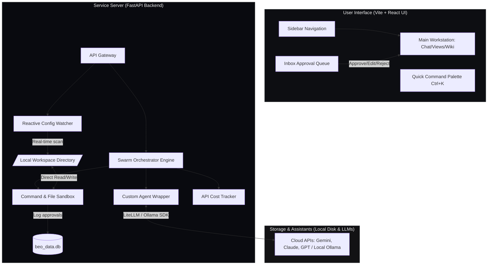

# <p align="center"></p>

<p align="center">
  
  
  
</p>

<p align="center">
  <b>BEO Solopreneur OS</b> is an open-source, minimalist, and local-first operating system that helps individuals run their entire business through a swarm workforce of AI Agents with strict human-in-the-loop supervision.
</p>

---

## 🐻 What is Beo?

Running a business alone (Solo Entrepreneur, Indie Hacker, Freelancer) always comes with a major challenge: limited time and skills. You have to act as a Software Developer, Marketing Specialist, Accountant, and Legal Counsel all at once.

**Beo** was created to change that. Inspired by the *"Company of One"* philosophy and the minimalist, high-performance design language of **Linear**, Beo provides a **Swarm Workforce of AI Agents** working in the background to bring your ideas to life, while you retain absolute control as the **Human-in-the-Loop Approval and Control Authority**.

> [!IMPORTANT]
> **Beo's Philosophy:** AI executes, humans approve. All business data resides completely under your local control on your hard drive. No third-party SaaS provider can lock your account or control your data.

---

## ✨ Core Features That Make a Difference

### 1. Local-First Architecture & Disk-as-Source-of-Truth
Beo does not duplicate your data to complex cloud databases. SQLite is only used to log activities and approval states. **All documents, department configurations, and company source code are read and written directly to your local drive in real time.**
* You can open the workspace folder in parallel using any external IDE (VS Code, Cursor, Obsidian).
* Any edits you make directly to source files will be instantly detected and updated on the UI via the **Reactive Config Watcher**.

### 2. Orchestration Assistant & 5-Minute Onboarding
Start with a blank slate. Simply chat with the **Secretary Agent** to interview your business idea. The system will automatically analyze and initialize **3 core structural documents**:
* `AIM.md`: Defines vision, mission, unique value proposition (UVP), and target customer personas.
* `OPERATIONS.md`: Proposes department structures and activates specialized AI Agents.
* `FINANCE.md`: Establishes API budgets (Daily/Monthly Cap) and initial legal reviews.

*Once you approve these files, the system automatically recruits the corresponding AI Agents, unlocks modules, and updates the sidebar navigation immediately.*

<p align="center"></p>

### 3. Strict Approval Queue (Inbox)
This is the security heartbeat of Beo. Every sensitive action proposed by an AI Agent is intercepted and queued in your Inbox as an intuitive **Approval Item**:
* **Read/Write File (`write_file`, `edit_file`)**: Displays a clear code diff (UI Diff) for review before overwriting.
* **Shell Command Execution (`run_command`)**: Displays the exact terminal command proposed to run.
* **Send Email (`send_email`)**: Allows you to read and directly edit the email body before hitting send.
* You have full control: **Approve (execute) / Edit (directly modify content) / Reject (decline)**.

### 4. Enterprise-Grade System Safety (Jailbreak-proof & Sandboxed)
* **Loop Guard**: Automatically terminates an Agent process if it detects an error loop repeating more than `5` times to protect your API balance.
* **Static Command Safety Filter**: Statically scans for dangerous keywords (`rm -rf`, `shutdown`, `del /s`...) to automatically escalate risk level to `HIGH` and flag red alerts in the Inbox.
* **Path Traversal Protection**: Validates absolute file paths, completely blocking any attempts to read or overwrite system files outside the workspace.

### 5. Swarm Orchestrator Engine (Multi-Mode Swarm Operation)
AI Agents collaborate dynamically through three modes of operation:
1. **Sequential Mode**: Passes accumulated context step-by-step through a pipeline (Planner designs -> Dev codes -> Marketer writes).
2. **Parallel Mode**: Utilizes multi-threading to execute independent tasks concurrently, maximizing performance speed.
3. **Collaborative/Consensus Mode**: Agents engage in multi-agent group discussions to self-reflect, peer-review, and optimize solutions before outputting the final result. All discussions are visualized in real-time as dynamic chat bubbles on the UI.

### 6. Centralized Log Panel & Agent Heartbeat Watchdog
A unified development console aggregates all backend activities (terminal executions, workflow step executions, swarm member logs) in real-time. It features an automated agent watchdog tracking online AI health (Healthy, Nudged, Escalated, Failed) with instant recovery reruns and manual retry controls for failed steps.

---

## 📐 System Architecture

Here is the data flow diagram showing how components in Beo interact with each other:



---

## 🛠️ Tech Stack

Beo is built on a modern, lean, and highly compatible technology stack:

| Component | Integrated Technologies | Role / Details |
| :--- | :--- | :--- |
| **Backend** | Python, FastAPI, Uvicorn | High-speed API Gateway, asynchronous multi-threading. |
| **LLM Gateway** | LiteLLM, Ollama SDK | Concurrent integration of Cloud LLMs and offline Local LLMs. |
| **Database** | SQLite, SQLAlchemy | Stores metadata, API cost tracking logs, and approval history. |
| **Vector Search**| LanceDB (Fallback to Keyword search) | Local vector database serving Agent semantic memory. |
| **Frontend** | Vite, React, TailwindCSS, Zustand | Minimalist, smooth UI with high-performance state management. |
| **Packaging** | Docker, Docker Compose | Consistent environment packaging, single-command startup. |

---

## 🚀 Installation & Quick Start

> [!TIP]
> We recommend **Method 1 (Docker Compose)** to spin up the system quickly and stably without needing manual programming environment setups.

### Method 1: Start via Docker Compose (Recommended)

Requires Docker and Docker Compose installed on your machine.

1. **Clone environment configuration**:
   ```bash
   cp backend/.env.example backend/.env
   ```
2. **Configure API Keys**:
   Open `backend/.env` with your text editor and fill in your desired API keys (e.g., `GEMINI_API_KEY`, `OPENAI_API_KEY`, or configure an Ollama Endpoint).
3. **Launch the containers**:
   ```bash
   docker compose up --build
   ```
4. **Access the application**:
   * **Web Interface**: [http://localhost:3000](http://localhost:3000)
   * **Backend API Docs**: [http://localhost:8000/docs](http://localhost:8000/docs)

*All your data remains safe under the local `./workspaces` directory and the `./beo_data.db` SQLite database file on your host machine.*

---

### Method 2: Local Manual Setup

#### 1. Setup and Run Backend:
```bash
# Navigate to the backend folder
cd backend

# Initialize Python virtual environment
python -m venv venv

# Activate virtual environment
# On macOS/Linux:
source venv/bin/activate
# On Windows:
.\venv\Scripts\activate

# Install dependencies
pip install -r requirements.txt

# Configure environment variables
cp .env.example .env

# Run development server
uvicorn app.main:app --reload --port 8000
```

#### 2. Setup and Run Frontend:
```bash
# Navigate to the frontend folder
cd frontend

# Install Node packages
npm install

# Start development server
npm run dev
```
Open the interface in your browser at the address displayed on your terminal (typically [http://localhost:5173](http://localhost:5173)).

---

## 🧪 Running Automated Tests

Beo comes with a comprehensive suite of automated tests to ensure sandbox security and correct agent behavior:

```bash
# Activate backend virtual environment
cd backend
source venv/bin/activate # or .\venv\Scripts\activate on Windows

# Run pytest
pytest
```

---

## 📂 Local Workspace Directory Structure

When Beo is active, your local hard drive files are structured as follows:

```text
beo/
├── beo_data.db                 # SQLite database for approval logs & metadata
├── docker-compose.yml          # Docker container configuration
├── backend/                    # FastAPI Backend source code
├── frontend/                   # React Frontend source code
└── workspaces/
    └── <company_workspace_id>/
        ├── .memory_db/         # LanceDB local directory for Agent semantic memory
        └── workspace/          # General wiki files (Shared Company Files)
            ├── AIM.md          # Company vision & UVP
            ├── OPERATIONS.md   # Department setups & active AI workforce
            ├── FINANCE.md      # API budget controls & cost caps
            └── projects/       # Directory for managing active campaigns / projects
                └── <project_name>/
                    ├── PRODUCT.md  # Product specifications & MVP scope
                    └── LOG.md      # Active project progress log
```

---

## 🤝 Contributing

We warmly welcome all contributions from the community to help make **Beo** the ultimate tool for solopreneurs!
1. Fork the project.
2. Create a feature branch (`git checkout -b feature/AmazingFeature`).
3. Commit your changes (`git commit -m 'Add some AmazingFeature'`).
4. Push to the branch (`git push origin feature/AmazingFeature`).
5. Open a **Pull Request** explaining your changes.

---

## 📄 License

This project is licensed under the MIT License - see the [LICENSE](LICENSE) file for details.

<p align="center">
  <b>Beo OS — Run a million-dollar company of one with the ultimate power of local AI.</b>
</p>
