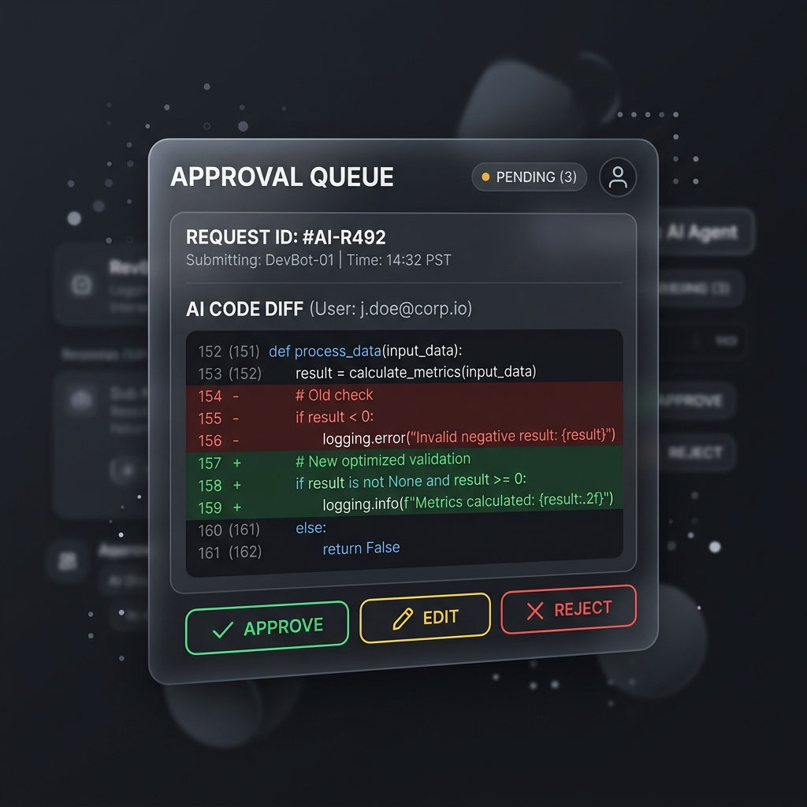

# <p align="center"></p>

<p align="center">
  
  
  
</p>

<p align="center">
  <b>BEO Solopreneur OS</b> là một hệ điều hành mã nguồn mở, tối giản và cục bộ (local-first) giúp một cá nhân vận hành toàn bộ doanh nghiệp của mình thông qua hệ thống nhân sự ảo (AI Agents) và các quy trình tự động hóa thông minh có kiểm duyệt nghiêm ngặt (Human-in-the-loop).
</p>

---

## 🐻 Beo là gì?

Vận hành một doanh nghiệp một mình (Solo Entrepreneur, Indie Hacker, Freelancer) luôn đi kèm với thách thức lớn về thời gian và giới hạn kỹ năng. Bạn vừa phải làm Lập trình viên, vừa làm Chuyên viên Marketing, vừa làm Kế toán, vừa làm Pháp lý. 

**Beo** ra đời để thay đổi điều đó. Lấy cảm hứng từ triết lý *"Company of One"* và phong cách thiết kế tối giản, hiệu năng cao của **Linear**, Beo cung cấp cho bạn một **Bầy nhân sự AI chuyên trách (Swarm Workforce)** làm việc ngầm để biến các ý tưởng của bạn thành hiện thực, trong khi bạn giữ vai trò là **Người phê duyệt và Kiểm soát tối cao (Human-in-the-loop)**.

> [!IMPORTANT]
> **Triết lý của Beo:** AI thực thi, con người phê duyệt. Toàn bộ dữ liệu doanh nghiệp nằm hoàn toàn dưới sự kiểm soát cục bộ của bạn trên ổ đĩa cứng. Không có nhà cung cấp SaaS trung gian nào có thể khóa tài khoản hoặc kiểm soát dữ liệu của bạn.

---

## ✨ Các tính năng cốt lõi làm nên sự khác biệt

### 1. Kiến trúc Local-First & Disk-as-Source-of-Truth
Beo không nhân bản dữ liệu của bạn vào các cơ sở dữ liệu đám mây phức tạp. SQLite chỉ được sử dụng để ghi nhật ký hoạt động và trạng thái phê duyệt. **Toàn bộ tài liệu, cấu hình phòng ban, và mã nguồn của công ty được đọc/ghi trực tiếp theo thời gian thực xuống ổ đĩa cục bộ.**
* Bạn có thể mở song song thư mục workspace bằng bất kỳ IDE ngoài nào (VS Code, Cursor, Obsidian).
* Mọi chỉnh sửa của bạn trên file nguồn sẽ ngay lập tức được hệ thống nhận diện và cập nhật lên UI nhờ **Reactive Config Watcher**.

### 2. Trợ lý Điều phối & Onboarding 5 Phút
Bắt đầu với một "trang giấy trắng" trống trơn. Bạn chỉ cần trò chuyện với **AI Thư ký (Secretary Agent)** để phỏng vấn ý tưởng kinh doanh. Hệ thống sẽ tự động phân tích và khởi tạo **3 tài liệu cấu trúc cốt lõi**:
* `AIM.md`: Định hình tầm nhìn, sứ mệnh, giá trị độc bản (UVP) và chân dung khách hàng.
* `OPERATIONS.md`: Đề xuất cơ cấu phòng ban và kích hoạt các AI Agents chuyên trách.
* `FINANCE.md`: Thiết lập ngân sách API (Daily/Monthly Cap) và rà soát pháp lý ban đầu.

*Khi bạn nhấn duyệt các file này, hệ thống sẽ tự động tuyển dụng các AI Agents tương ứng, mở khóa các module và cập nhật thanh Sidebar ngay lập tức.*

<p align="center"></p>

### 3. Hàng đợi phê duyệt nghiêm ngặt (Approval Queue / Inbox)
Đây là trái tim bảo mật của Beo. Mọi hành động nhạy cảm của AI đều bị chặn lại và đẩy vào Inbox của bạn dưới dạng một **Approval Item** trực quan:
* **Đọc/Ghi file (`write_file`, `edit_file`)**: Hiển thị khung so sánh mã nguồn (UI Diff) rõ ràng để bạn kiểm tra trước khi ghi đè.
* **Thực thi lệnh shell (`run_command`)**: Hiển thị chính xác câu lệnh terminal chuẩn bị chạy.
* **Gửi email (`send_email`)**: Cho phép bạn đọc và chỉnh sửa trực tiếp nội dung thư trước khi nhấn nút gửi.
* Bạn có toàn quyền: **Approve (Phê duyệt) / Edit (Chỉnh sửa trực tiếp nội dung) / Reject (Từ chối)**.

### 4. An toàn hệ thống vượt trội (Jailbreak-proof & Sandboxed)
* **Loop Guard**: Tự động ngắt tiến trình của Agent nếu phát hiện vòng lặp lỗi liên tục quá `5` lần để bảo toàn ví tiền tài khoản API của bạn.
* **Static Command Safety Filter**: Quét tĩnh các từ khóa nguy hiểm (`rm -rf`, `shutdown`, `del /s`...) để tự động cưỡng chế nâng mức rủi ro lên `HIGH` và đẩy cảnh báo đỏ vào Inbox.
* **Path Traversal Protection**: Kiểm tra an toàn đường dẫn tuyệt đối, chặn đứng mọi hành vi ghi đè file hệ thống bên ngoài workspace.

### 5. Swarm Orchestrator Engine (Đa chế độ Vận hành Bầy đàn)
Các nhân sự AI hoạt động linh hoạt thông qua 3 chế độ cộng tác:
1. **Chế độ Tuần tự (Sequential)**: Chuyển giao ngữ cảnh tích lũy xuyên suốt chuỗi công việc (Planner lập kế hoạch -> Dev viết code -> Marketer viết bài).
2. **Chế độ Song song (Parallel)**: Tận dụng đa luồng để thực thi nhiều tác vụ độc lập cùng lúc, giúp tăng tốc tối đa hiệu năng.
3. **Chế độ Thảo luận (Collaborative/Consensus)**: Các Agent tham gia vào cuộc thảo luận nhóm đa chiều để tự phản biện và tối ưu hóa giải pháp trước khi đưa ra kết quả cuối cùng. Toàn bộ hội thoại được hiển thị thời gian thực dưới dạng bóng chat sinh động trên UI.

---

## 📐 Kiến trúc hệ thống

Dưới đây là sơ đồ luồng dữ liệu và cách các thành phần trong Beo tương tác với nhau:

```mermaid
graph TD
    subgraph Giao diện người dùng [Vite + React UI]
        Sidebar[Thanh điều hướng Sidebar] --> MainArea[Bảng làm việc chính Chat/Views/Wiki]
        Inbox[Hàng đợi phê duyệt Inbox] -->|Duyệt/Sửa/Từ chối| MainArea
        CmdK[Thanh lệnh nhanh Ctrl+K]
    end

    subgraph Máy chủ dịch vụ [FastAPI Backend]
        Gateway[API Gateway] --> Engine[Swarm Orchestrator Engine]
        Gateway --> Watcher[Reactive Config Watcher]
        Engine --> AgentWrap[Custom Agent Wrapper]
        Engine --> Sandbox[Command & File Sandbox]
        Engine --> APILog[API Cost Tracker]
        
        Watcher -->|Quét thời gian thực| Disk
        Sandbox -->|Ghi log phê duyệt| SQLite[(beo_data.db)]
    end

    subgraph Lưu trữ & Trợ lý [Local Disk & LLMs]
        Disk[/Thư mục Workspace cục bộ/] <-->|Đọc/Ghi trực tiếp| Sandbox
        AgentWrap <-->|LiteLLM / Ollama SDK| LLMProviders[Cloud APIs: Gemini, Claude, GPT / Local Ollama]
    end

    style Giao diện người dùng fill:#0d0e12,stroke:#1c1e21,stroke-width:2px,color:#f4f4f5
    style Máy chủ dịch vụ fill:#090a0f,stroke:#1c1e21,stroke-width:2px,color:#f4f4f5
    style Lưu trữ & Trợ lý fill:#121214,stroke:#1c1e21,stroke-width:2px,color:#f4f4f5
```

---

## 🛠️ Công nghệ sử dụng

Beo được xây dựng trên một bộ khung công nghệ hiện đại, tinh gọn và có tính tương thích cao:

| Thành phần | Công nghệ tích hợp | Vai trò / Chi tiết |
| :--- | :--- | :--- |
| **Backend** | Python, FastAPI, Uvicorn | API Gateway tốc độ cao, xử lý đa luồng bất đồng bộ. |
| **LLM Gateway** | LiteLLM, Ollama SDK | Tích hợp đồng thời cả Cloud LLMs và Local LLMs chạy offline. |
| **Database** | SQLite, SQLAlchemy | Lưu trữ metadata, nhật ký chi phí API và lịch sử phê duyệt. |
| **Vector Search**| LanceDB (Fallback sang Keyword search) | Cơ sở dữ liệu vector cục bộ phục vụ bộ nhớ ngữ nghĩa của Agent. |
| **Frontend** | Vite, React, TailwindCSS, Zustand | UI tối giản, mượt mà, quản lý trạng thái hiệu năng cao. |
| **Đóng gói** | Docker, Docker Compose | Đóng gói môi trường nhất quán, chạy nhanh bằng một dòng lệnh. |

---

## 🚀 Hướng dẫn Cài đặt & Chạy nhanh

> [!TIP]
> Bạn nên sử dụng **Cách 1 (Docker Compose)** để khởi động hệ thống nhanh chóng và ổn định nhất mà không cần cài đặt môi trường lập trình thủ công.

### Cách 1: Khởi động qua Docker Compose (Khuyên dùng)

Yêu cầu máy tính của bạn đã cài đặt Docker và Docker Compose.

1. **Bản sao cấu hình môi trường**:
   ```bash
   cp backend/.env.example backend/.env
   ```
2. **Cấu hình API Key**:
   Mở file `backend/.env` bằng trình chỉnh sửa của bạn và điền khóa API mong muốn (ví dụ: `GEMINI_API_KEY`, `OPENAI_API_KEY`, hoặc cấu hình Ollama Endpoint).
3. **Khởi chạy container**:
   ```bash
   docker compose up --build
   ```
4. **Truy cập hệ thống**:
   * **Giao diện Web**: [http://localhost:3000](http://localhost:3000)
   * **Tài liệu API Backend**: [http://localhost:8000/docs](http://localhost:8000/docs)

*Toàn bộ dữ liệu của bạn sẽ được lưu giữ an toàn tại thư mục `./workspaces` và tệp cơ sở dữ liệu `./beo_data.db` trên máy thật.*

---

### Cách 2: Chạy cục bộ thủ công (Local Manual Setup)

#### 1. Cài đặt và chạy Backend:
```bash
# Di chuyển vào thư mục backend
cd backend

# Khởi tạo môi trường ảo Python
python -m venv venv

# Kích hoạt môi trường ảo
# Trên macOS/Linux:
source venv/bin/activate
# Trên Windows:
.\venv\Scripts\activate

# Cài đặt các thư viện dependencies
pip install -r requirements.txt

# Cấu hình môi trường
cp .env.example .env

# Chạy máy chủ phát triển
uvicorn app.main:app --reload --port 8000
```

#### 2. Cài đặt và chạy Frontend:
```bash
# Di chuyển vào thư mục frontend
cd frontend

# Cài đặt các thư viện Node
npm install

# Khởi chạy giao diện nhà phát triển
npm run dev
```
Truy cập giao diện tại địa chỉ được hiển thị trên terminal (thường là [http://localhost:5173](http://localhost:5173)).

---

## 🧪 Chạy Kiểm thử Tự động (Tests)

Beo tích hợp sẵn bộ suite kiểm thử tự động toàn diện để bảo đảm tính an toàn của sandbox và hoạt động chính xác của các Agent:

```bash
# Kích hoạt môi trường ảo backend
cd backend
source venv/bin/activate # hoặc .\venv\Scripts\activate trên Windows

# Khởi chạy pytest
pytest
```

---

## 📂 Cấu trúc thư mục Workspace cục bộ

Khi Beo hoạt động, cấu trúc tệp tin trên đĩa cứng của bạn sẽ được tổ chức như sau:

```text
beo/
├── beo_data.db                 # SQLite lưu log phê duyệt & metadata
├── docker-compose.yml          # Cấu hình container Docker
├── backend/                    # Mã nguồn FastAPI Backend
├── frontend/                   # Giao diện React Frontend
└── workspaces/
    └── <company_workspace_id>/
        ├── .memory_db/         # LanceDB lưu vector bộ nhớ Agent
        └── workspace/          # Thư mục Wiki chung (Company Files)
            ├── AIM.md          # Tầm nhìn & UVP của doanh nghiệp
            ├── OPERATIONS.md   # Cấu hình phòng ban & Nhân viên AI
            ├── FINANCE.md      # Thiết lập ngân sách & Giới hạn API
            └── projects/       # Thư mục quản lý các chiến dịch / dự án
                └── <project_name>/
                    ├── PRODUCT.md  # Đặc tả sản phẩm & Scope MVP
                    └── LOG.md      # Nhật ký tiến độ chạy dự án
```

---

## 🤝 Hướng dẫn Đóng góp (Contributing)

Chúng tôi rất hoan nghênh sự đóng góp từ cộng đồng để đưa **Beo** trở thành công cụ hỗ trợ solopreneur mạnh mẽ nhất!
1. Fork dự án này.
2. Tạo nhánh tính năng mới (`git checkout -b feature/AmazingFeature`).
3. Commit những thay đổi của bạn (`git commit -m 'Add some AmazingFeature'`).
4. Push lên nhánh gốc (`git push origin feature/AmazingFeature`).
5. Mở một **Pull Request** mới giải thích chi tiết các thay đổi của bạn.

---

## 📄 Giấy phép (License)

Dự án này được cấp phép theo Giấy phép MIT - xem tệp [LICENSE](LICENSE) để biết thêm chi tiết.

<p align="center">
  <b>Beo OS — Vận hành doanh nghiệp triệu đô một người bằng sức mạnh tối thượng của AI cục bộ.</b>
</p>
